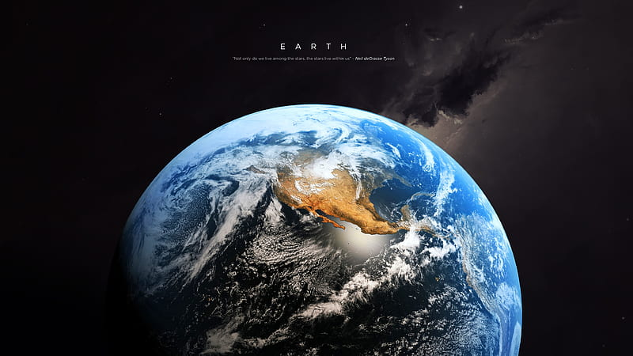

# Hola-Mundo

- Vamos a hacer una prueba para poder volver al estado inicial del proyecto
  - Hemos comprobado que podemos descargarnos versiones y trabajar con ellas
 
- Vamos a añadir una foto entre el texto

  

- Vamos a añadir un link
  - [alejandrobp90](https://github.com/alejandrobp90/Hola-Mundo)
 

Nuestro hogar, el planeta Tierra, es un planeta terrestre y rocoso. Tiene una superficie sólida y activa, con montañas, valles, cañones, llanuras y mucho más. La Tierra es especial porque es un planeta océano, ya que el agua cubre el 70% de su superficie.
Nuestra atmósferaestá compuesta, en gran parte, por nitrógeno. También tiene mucho oxígeno, que nos permite respirar. Además, nos protege de los meteoroides que se acercan a la Tierra, la mayoría de los cuales se desintegran en nuestra atmósfera antes de llegar a la superficie en forma de meteoritos.

Es posible que, como se trata de nuestro hogar, pienses que lo sabemos todo sobre la Tierra. ¡La verdad es que no! Aún nos queda mucho por aprender sobre nuestro planeta. Actualmente, hay muchos satélites en órbita alrededor de la Tierra, tomando fotos y realizando mediciones. Esto nos permite saber más cosas sobre el clima, los océanos, la tierra, el cambio climático y muchos otros temas importantes.
