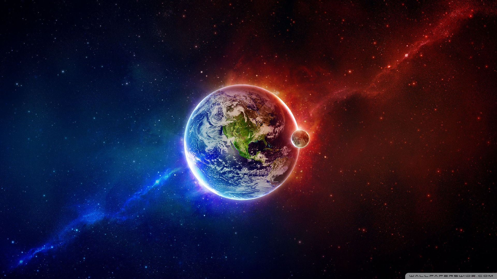

# Hola-Mundo

- Vamos a hacer una prueba para poder volver al estado inicial del proyecto
  - Hemos comprobado que podemos descargarnos versiones y trabajar con ellas
 
- Vamos a añadir una foto entre el texto

  
- Vamos a añadir un link
  - [alejandrobp90](https://github.com/alejandrobp90/Hola-Mundo)
